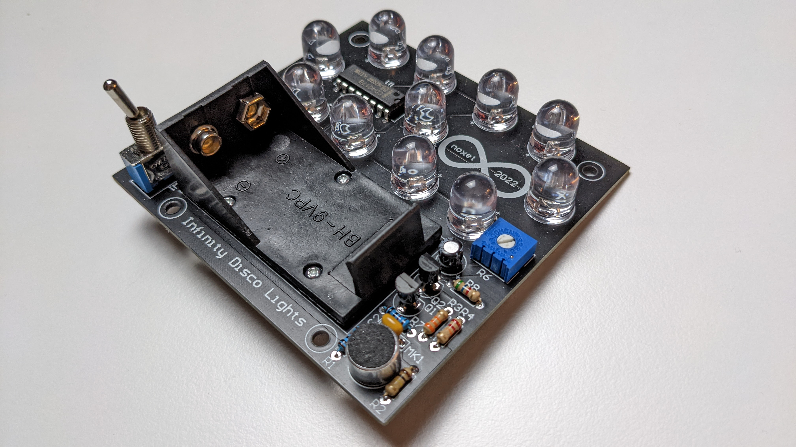

# Infinity Disco Lights

Infinity Disco Lights is an audio-reactive LED light bar built without a microcontroller.

An electret microphone captures the surrounding audio signal, which is conditioned via a 2-stage amplifier and used to drive a digital counter. The counter outputs are then repurposed to create changing LED patterns in response to sound.

The project intentionally uses simple analog and digital logic rather than firmware, turning a basic counter into the core of an audio-reactive lighting system.

The design includes:

* **Electret microphone input** - captures ambient audio
* **Analog signal conditioning** - prepares the microphone signal for the logic circuitry
* **Digital counter** - generates the LED sequencing patterns

The project explores how simple digital logic can be creatively repurposed to produce visually interesting behavior from an analog audio signal.
